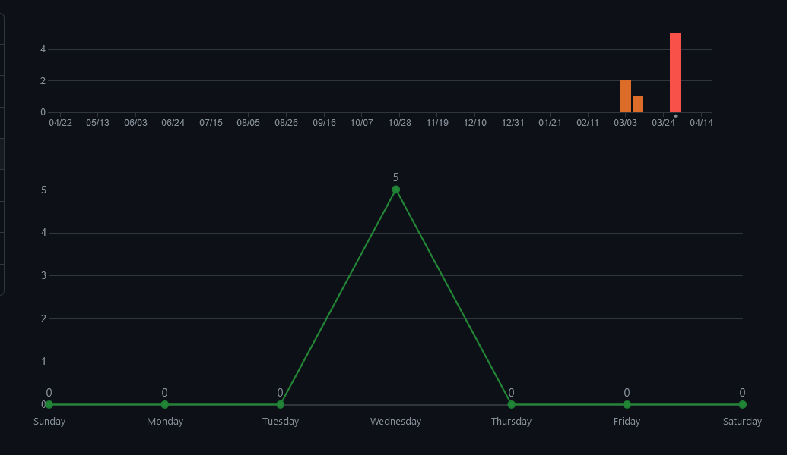
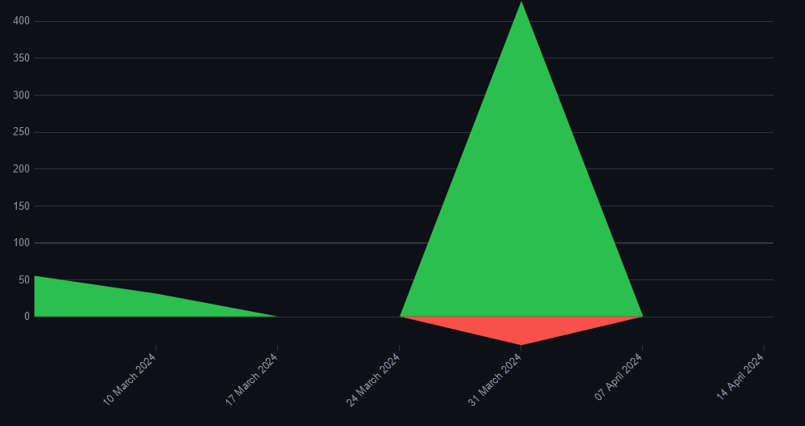
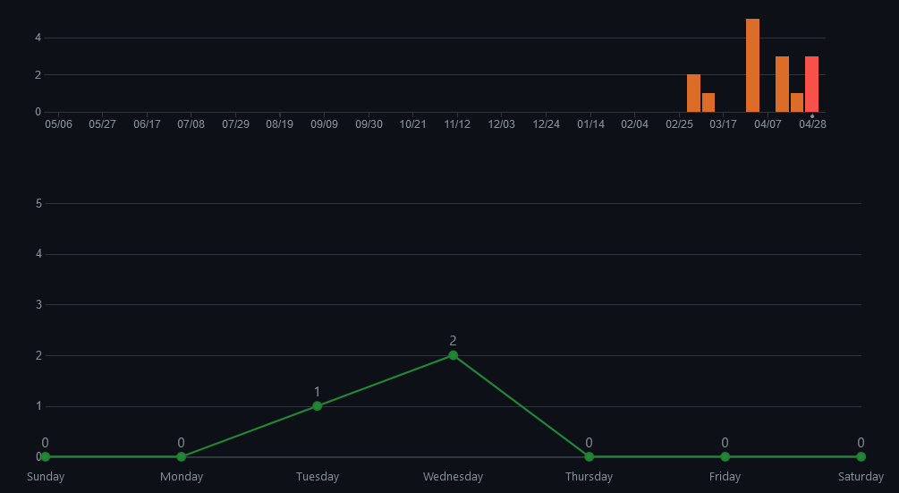
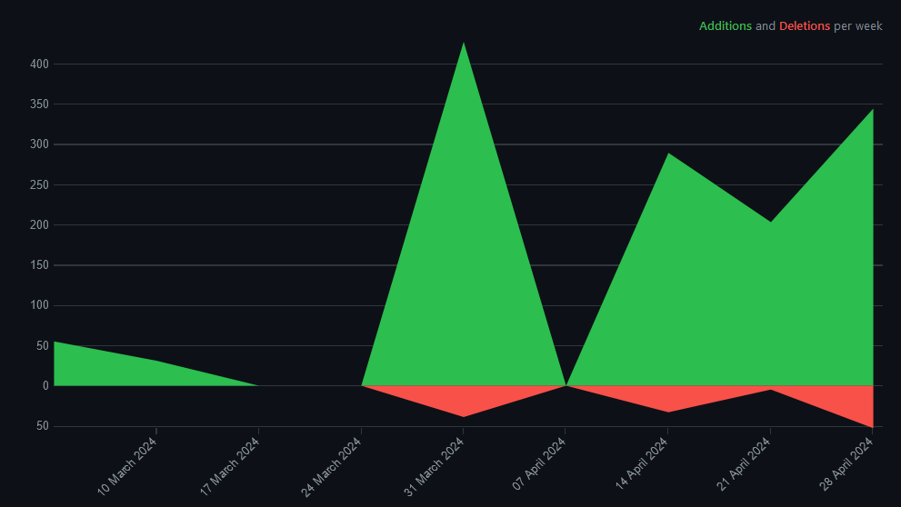
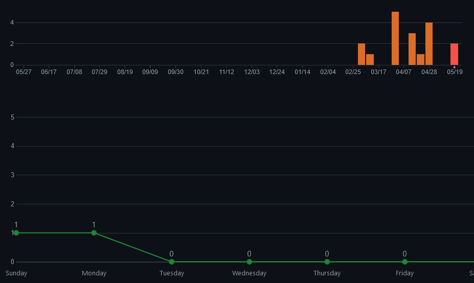
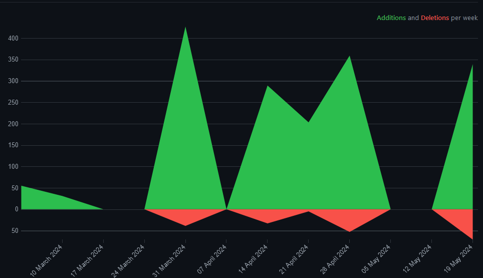
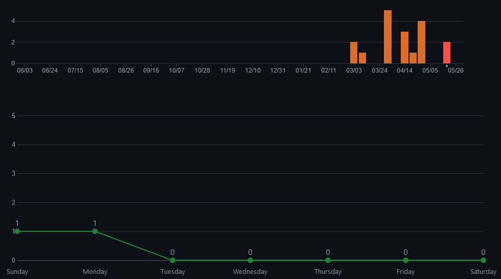
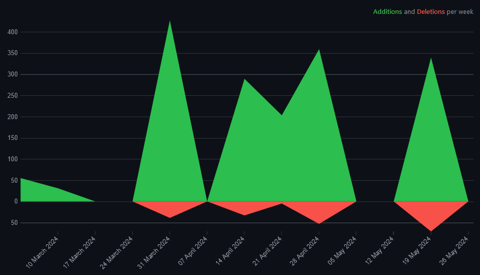
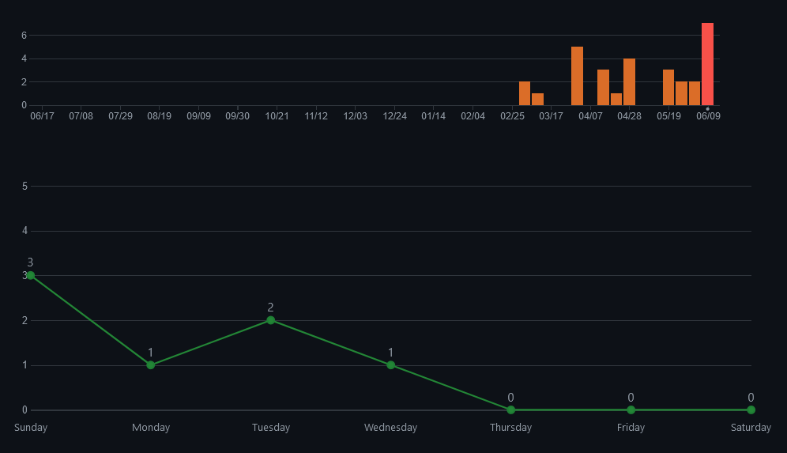
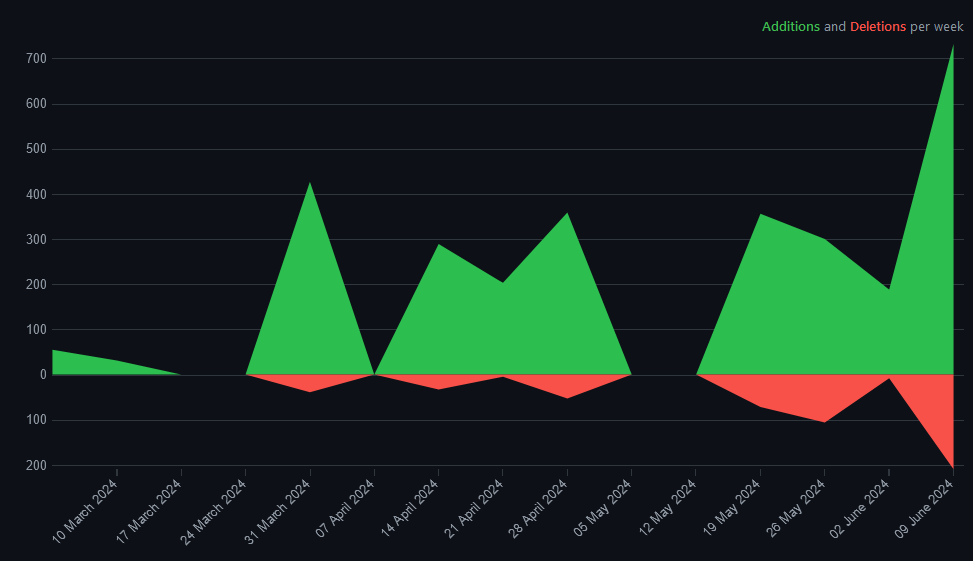

[//]: <> 
************************************
Name: Simone Sperrer
Klasse: 2AHITM
Projektname: Yoga Place
Github: https://github.com/htl-leo-medtwt-projects/medtwt-sommerprojekt-2324-SimoneSperrer.git
************************************

# Projektdokumentation

## Figma:
https://www.figma.com/file/39O0uefOCuAjBpl4Pj7QLf/Untitled?type=design&node-id=0%3A1&mode=design&t=6kAITeBsYcT3EjSE-1

## Sprintdokumentation:
### Zielsetzung bis zum 16.April 2024
* das Grundgerüst Fertigstellen d.h. alle html Seiten erstellen
* die html Seite "kurse.html" mit allen js interaktionen ausprogramieren.
* css implementierung anfangen.
### Erreichte Ziele
* Erstellen des html Grundgerüst
* Das implementieren der von js in der html Seite "kurse.html"
* css implementierung vom Grundgerüst fertiggestellt.
#### Commits:

#### Code Frequenzy:

### Zielsetzung bis zum 01.Mai 2024
* Ausprogramieren der einzelnen Buchungsunterseiten
* Einbinden der Funktion einzelne Kurse zu buchen.
* Localstorage
### Erreichte Ziele
* Ausprogramieren des html codes mit Styling.
* Einbinden der Funktion einzelne Kurse zu buchen.
### Nicht Ereichte Ziele
* JS generierung der Unterseiten.
* Localstorage funktioniert aber die einzelnen Buchungen überschreiben sich gegenseitig.
#### Commits:

#### Code Frequenzy:

### Zielsetzung bis zum (~~15.Mai 2024~~) 22.Mai 2024
* Localstorage fertigstellen
* JS generierung der Unterseiten
* Errinerung an den bereits gebuchten Kurs auf der Homeseite
* Design der AboutUs.html
### Erreichte Ziele
* Localstorage fertigstellen
* JS generierung der Unterseiten
* Errinerung an den bereits gebuchten Kurs auf der Homeseite
### Nicht Ereichte Ziele
* Design der AboutUs.html
#### Commits:

#### Code Frequenzy:

### Zielsetzung bis zum 28.Mai 2024
* Design der AboutUs.html
* Funktion zu löschen der gebuchten Kurse.
* Design und funktion der Atemübungen
* Einbauen von Swiper in die seite Kurse.html

### Erreichte Ziele
* Einbauen von Swiper in die seite Kurse.html
### Nicht Ereichte Ziele
* Design der AboutUs.html
* Funktion zu löschen der gebuchten Kurse.
* Design und funktion der Atemübungen
#### Commits:

#### Code Frequenzy:

### Zielsetzung bis zum 12.Juni 2024
* Design der AboutUs.html
* Funktion zu löschen der gebuchten Kurse.
* Design und funktion der Atemübungen
* Responsive
* Dark Mode 
### Erreichte Ziele
* Funktion zum Löschen der Kurse
* Design der AboutUs.html
* Design und funktionalität der Atemübungen.
* Responsive
* Dark Mode
### Nicht Ereichte Ziele
* 
#### Commits:

#### Code Frequenzy:
